# AgentForge Diagrams

This document contains visual diagrams for the AgentForge framework architecture and roadmap.

---

## Monorepo Structure

```mermaid
graph TB
    subgraph "AgentForge Monorepo"
        Root[Root Package<br/>agentforge]
        
        subgraph "Packages"
            Core["@agentforge/core<br/>✅ Setup Complete"]
            Patterns["@agentforge/patterns<br/>📋 Planned"]
            Tools["@agentforge/tools<br/>📋 Planned"]
            Testing["@agentforge/testing<br/>📋 Planned"]
            CLI["@agentforge/cli<br/>📋 Planned"]
        end
        
        subgraph "Documentation"
            Design[FRAMEWORK_DESIGN.md]
            Roadmap[ROADMAP.md]
            Spec[TOOL_REGISTRY_SPEC.md]
            Setup[MONOREPO_SETUP.md]
        end
        
        subgraph "Tooling"
            TS[TypeScript 5.3]
            Build[tsup]
            Test[Vitest]
            Lint[ESLint + Prettier]
        end
        
        Root --> Core
        Root --> Patterns
        Root --> Tools
        Root --> Testing
        Root --> CLI
        
        Core -.-> TS
        Core -.-> Build
        Core -.-> Test
        Core -.-> Lint
    end
    
    style Core fill:#4ade80,stroke:#22c55e,color:#000
    style Patterns fill:#94a3b8,stroke:#64748b,color:#000
    style Tools fill:#94a3b8,stroke:#64748b,color:#000
    style Testing fill:#94a3b8,stroke:#64748b,color:#000
    style CLI fill:#94a3b8,stroke:#64748b,color:#000
    style Root fill:#60a5fa,stroke:#3b82f6,color:#000
```

---

## Development Roadmap

---

## Tool Registry Architecture (Planned)

---

## Package Dependencies (Future)

---

## Notes

- **Green** = Complete/Active
- **Gray** = Planned
- **Blue** = Core/Foundation
- **Orange** = Tools/Utilities
- **Purple** = Metadata/Configuration
- **Pink** = Integration/CLI

To view these diagrams:
1. Use a Markdown viewer that supports Mermaid (GitHub, VS Code with extensions, etc.)
2. Copy the Mermaid code to [Mermaid Live Editor](https://mermaid.live/)
3. Use the Augment Agent's `render-mermaid` tool
