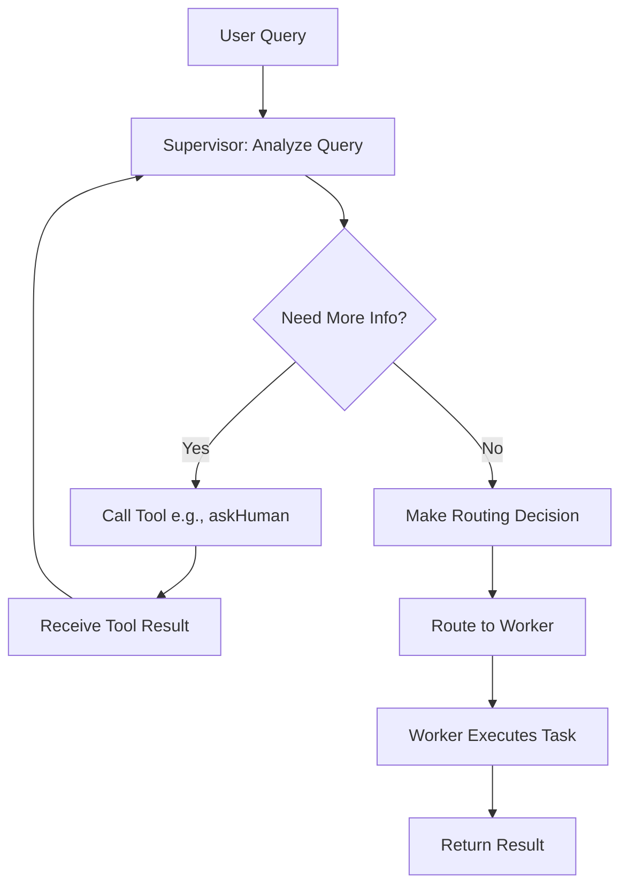

# Feature: Tool-Enabled Supervisor for Multi-Agent Pattern

**Status**: 📋 Planned
**Priority**: High
**Target Phase**: Phase 5.6 (Production Features)
**Estimated Effort**: 5-7 hours
**Created**: 2026-01-22

---

## 📋 Overview

### Problem Statement

Currently, the multi-agent pattern's supervisor can only route tasks to workers based on predefined strategies (LLM-based, skill-based, rule-based, etc.). However, in real-world scenarios, the supervisor often needs to gather additional information before making routing decisions:

- **Ambiguous queries**: User intent is unclear
- **Missing context**: Required information not provided
- **Clarification needed**: Multiple valid interpretations exist
- **Dynamic information**: Need to query external systems before routing

**Current Limitation**: The supervisor cannot use tools (like `askHuman`, database queries, API calls) during the routing process.

### Proposed Solution

Enable the supervisor to use tools during the routing decision process, with special support for the `askHuman` tool to request clarification from users when needed.

**Key Capabilities**:
1. Supervisor can bind tools (especially `askHuman`)
2. LLM-based routing detects and executes tool calls
3. Routing retries with tool results as additional context
4. Backward compatible - tools are optional
5. Works with any tool, not just `askHuman`

---

## 🎯 Use Cases

### 1. Customer Support System
```typescript
// Supervisor asks for order number if missing
const supportSystem = createMultiAgentSystem({
  supervisor: {
    model: llm,
    strategy: 'llm-based',
    tools: [askHumanTool, lookupOrderTool],
  },
  workers: [technicalSupport, billingSupport, generalSupport],
});
```

### 2. Task Delegation System
```typescript
// Supervisor asks for priority/deadline if unclear
const taskSystem = createMultiAgentSystem({
  supervisor: {
    model: llm,
    strategy: 'llm-based',
    tools: [askHumanTool, checkCalendarTool],
  },
  workers: [urgentTaskWorker, normalTaskWorker, backgroundWorker],
});
```

### 3. PTY AGI System
```typescript
// Supervisor asks for clarification on ambiguous queries
const ptyAgi = createMultiAgentSystem({
  supervisor: {
    model: llm,
    strategy: 'llm-based',
    tools: [askHumanTool],
    systemPrompt: `Route to HR, Security, Code, or Legal agents.
    If query is ambiguous, use ask-human tool for clarification.`,
  },
  workers: [hrAgent, securityAgent, codeAgent, legalAgent],
});
```

---

## 🏗️ Architecture Design

### Current Flow
```
User Query → Supervisor (routing only) → Worker Agent → Result
```

### New Flow with Tools
```
User Query → Supervisor (can use tools) → [Tool Execution if needed] → Routing Decision → Worker Agent → Result
```

### Detailed Routing Flow


---

## 📐 Technical Design

### 1. Type Updates

**File**: `packages/patterns/src/multi-agent/types.ts`

```typescript
import type { Tool } from '@agentforge/core';

export interface SupervisorConfig {
  model?: BaseChatModel;
  strategy: RoutingStrategy;
  systemPrompt?: string;
  routingFn?: (state: MultiAgentStateType) => Promise<RoutingDecision>;
  verbose?: boolean;
  maxIterations?: number;

  // NEW: Optional tools for supervisor
  tools?: Tool<any, any>[];

  // NEW: Max tool call retries
  maxToolRetries?: number;
}
```

### 2. Routing Logic Updates

**File**: `packages/patterns/src/multi-agent/routing.ts`

Key changes to `llmBasedRouting`:

1. Check if response contains `tool_calls`
2. If yes, execute tools and retry routing with results
3. If no, parse JSON routing decision as before
4. Handle tool execution errors gracefully
5. Prevent infinite loops with max retries


**Pseudocode**:
```typescript
async function llmBasedRoutingWithTools(state, config) {
  let attempt = 0;
  const maxRetries = config.maxToolRetries || 3;
  const conversationHistory = [];

  while (attempt < maxRetries) {
    // Invoke LLM with conversation history
    const response = await config.model.invoke([
      new SystemMessage(systemPrompt),
      new HumanMessage(userPrompt),
      ...conversationHistory,
    ]);

    // Check for tool calls
    if (response.tool_calls && response.tool_calls.length > 0) {
      // Execute tools
      const toolResults = await executeTools(response.tool_calls, config.tools);

      // Add to conversation history
      conversationHistory.push(
        new AIMessage({ content: response.content, tool_calls: response.tool_calls }),
        ...toolResults.map(r => new ToolMessage(r))
      );

      attempt++;
      continue; // Retry routing with tool results
    }

    // No tool calls - parse routing decision
    const content = typeof response.content === 'string'
      ? response.content
      : JSON.stringify(response.content);

    try {
      const decision = JSON.parse(content);
      return {
        targetAgent: decision.targetAgent,
        reasoning: decision.reasoning,
        confidence: decision.confidence,
        strategy: 'llm-based',
        timestamp: Date.now(),
      };
    } catch (error) {
      throw new Error(`Failed to parse routing decision: ${error}`);
    }
  }

  throw new Error(`Max tool retries (${maxRetries}) exceeded without routing decision`);
}
```

### 3. Agent Creation Updates

**File**: `packages/patterns/src/multi-agent/agent.ts`

```typescript
import { toLangChainTools } from '@agentforge/core';

export function createMultiAgentSystem(config: MultiAgentConfig) {
  // ... existing code ...

  // NEW: Bind tools to supervisor model if provided
  let supervisorModel = config.supervisor.model;
  if (config.supervisor.tools && config.supervisor.tools.length > 0) {
    const langchainTools = toLangChainTools(config.supervisor.tools);
    supervisorModel = supervisorModel.bindTools(langchainTools);
  }

  const supervisorNode = createSupervisorNode({
    ...config.supervisor,
    model: supervisorModel,
  });

  // ... rest of existing code ...
}
```

### 4. Tool Execution Helper

**File**: `packages/patterns/src/multi-agent/routing.ts`

```typescript
import { ToolMessage } from '@langchain/core/messages';

async function executeTools(
  toolCalls: any[],
  tools: Tool<any, any>[]
): Promise<ToolMessage[]> {
  const results: ToolMessage[] = [];

  for (const toolCall of toolCalls) {
    const tool = tools.find(t => t.metadata.name === toolCall.name);

    if (!tool) {
      results.push(new ToolMessage({
        content: `Error: Tool '${toolCall.name}' not found`,
        tool_call_id: toolCall.id,
      }));
      continue;
    }

    try {
      const result = await tool.execute(toolCall.args);
      const content = typeof result === 'string'
        ? result
        : JSON.stringify(result);

      results.push(new ToolMessage({
        content,
        tool_call_id: toolCall.id,
      }));
    } catch (error) {
      results.push(new ToolMessage({
        content: `Error executing tool: ${error.message}`,
        tool_call_id: toolCall.id,
      }));
    }
  }

  return results;
}
```

---

## 🧪 Testing Strategy

### Unit Tests

**File**: `packages/patterns/tests/multi-agent/routing-with-tools.test.ts`

1. **Supervisor with askHuman tool**
   - Test tool call detection
   - Test tool execution
   - Test routing after tool result

2. **Tool call retry logic**
   - Test multiple tool calls before routing
   - Test max retry limit
   - Test conversation history accumulation

3. **Fallback to JSON**
   - Test routing without tool calls
   - Test backward compatibility (no tools provided)

4. **Error handling**
   - Test tool execution failures
   - Test missing tool errors
   - Test malformed tool calls

5. **Backward compatibility**
   - Test existing systems without tools
   - Test all routing strategies still work


### Integration Tests

**File**: `packages/patterns/tests/multi-agent/integration-with-tools.test.ts`

1. **Complete workflow with askHuman**
   - User query → supervisor asks for clarification → user responds → routing → worker execution

2. **Multiple tool calls**
   - Supervisor uses multiple tools before routing

3. **Tool call + routing in same workflow**
   - Test seamless integration

---

## 📚 Documentation Updates

### 1. Multi-Agent Pattern Guide

**File**: `packages/patterns/docs/multi-agent-pattern.md`

Add new section:
- "Tool-Enabled Supervisor"
- "Using askHuman for Clarification"
- "Best Practices for Supervisor Tools"
- "Migration Guide"

### 2. API Reference

Update `SupervisorConfig` documentation with:
- `tools` parameter
- `maxToolRetries` parameter
- Examples

### 3. Examples

**File**: `packages/patterns/examples/multi-agent/05-supervisor-with-askhuman.ts`

Complete example demonstrating:
- Supervisor with askHuman tool
- Handling ambiguous queries
- Routing after clarification

---

## 📦 Implementation Checklist

### Phase 1: Core Implementation (2-3 hours)
- [ ] Update `SupervisorConfig` type to accept `tools` and `maxToolRetries`
- [ ] Implement tool execution helper function
- [ ] Update `llmBasedRouting` to detect and execute tool calls
- [ ] Update `createMultiAgentSystem` to bind tools to supervisor model
- [ ] Add conversation history tracking for tool calls

### Phase 2: Testing (1-2 hours)
- [ ] Unit tests for tool call detection
- [ ] Unit tests for tool execution
- [ ] Unit tests for retry logic
- [ ] Unit tests for error handling
- [ ] Integration tests for complete workflow
- [ ] Backward compatibility tests

### Phase 3: Documentation (1 hour)
- [ ] Update multi-agent pattern guide
- [ ] Update API reference
- [ ] Add migration guide
- [ ] Document best practices

### Phase 4: Examples (1 hour)
- [ ] Create supervisor-with-askhuman example
- [ ] Update existing examples with notes
- [ ] Add to examples README

### Phase 5: PTY AGI Integration (30 min)
- [ ] Update PTY AGI to use tool-enabled supervisor
- [ ] Test with ambiguous queries
- [ ] Verify askHuman integration

---

## 🎯 Success Criteria

1. **Functionality**
   - ✅ Supervisor can use tools during routing
   - ✅ askHuman tool works seamlessly
   - ✅ Routing works after tool execution
   - ✅ Error handling is robust

2. **Backward Compatibility**
   - ✅ Existing systems work without changes
   - ✅ All routing strategies still function
   - ✅ No breaking changes to API

3. **Quality**
   - ✅ >80% test coverage
   - ✅ All tests passing
   - ✅ TypeScript compilation successful
   - ✅ No linting errors

4. **Documentation**
   - ✅ Complete API documentation
   - ✅ Working examples
   - ✅ Migration guide
   - ✅ Best practices documented

---

## 🚀 Rollout Plan

### Step 1: Development (Week 1)
- Implement core feature in `@agentforge/patterns`
- Write comprehensive tests
- Ensure backward compatibility

### Step 2: Documentation (Week 1)
- Update all documentation
- Create examples
- Write migration guide

### Step 3: Integration (Week 1)
- Update PTY AGI playground
- Test in real-world scenario
- Gather feedback

### Step 4: Release (Week 2)
- Release as part of `@agentforge/patterns` v0.2.0
- Announce feature in changelog
- Update main README

---

## 🔗 Related Issues

- PTY AGI: Need for supervisor to ask clarification questions
- Multi-agent pattern: Limited supervisor capabilities
- Human-in-the-loop: Integration with multi-agent systems

---

## 📝 Notes

### Design Decisions

1. **Why modify llmBasedRouting instead of creating new strategy?**
   - Tool support is a natural extension of LLM-based routing
   - Keeps API simple and intuitive
   - Backward compatible by making tools optional

2. **Why limit to LLM-based routing?**
   - Other strategies (skill-based, rule-based) don't use LLMs
   - Tool calls are an LLM feature
   - Can be extended to other strategies if needed

3. **Why max retry limit?**
   - Prevents infinite loops
   - Ensures system doesn't get stuck
   - Provides clear error messages

### Future Enhancements

1. **Tool call streaming**: Stream tool execution progress
2. **Parallel tool execution**: Execute multiple tools concurrently
3. **Tool call caching**: Cache tool results for similar queries
4. **Advanced tool selection**: LLM chooses which tools to use dynamically

---

## 👥 Stakeholders

- **AgentForge Users**: Benefit from more capable supervisors
- **PTY AGI Project**: Immediate use case and testing ground
- **Framework Maintainers**: New feature to maintain and support

---

**Last Updated**: 2026-01-22
**Document Owner**: AgentForge Core Team
**Status**: Ready for Implementation
